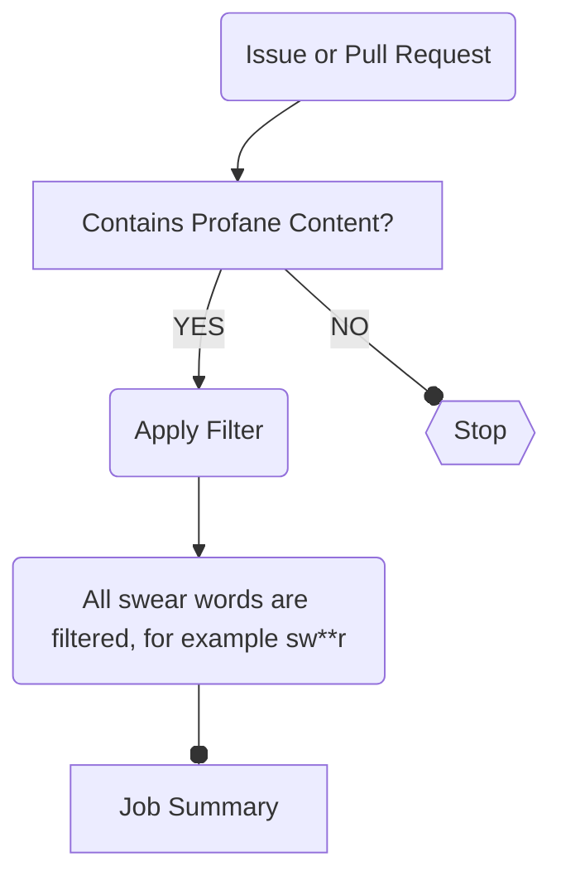

# Potty Mouth: GitHub Action

> 🤬 Profane content filter

[](https://github.com/IEvangelist/profanity-filter/actions/workflows/dotnet.yml) [](https://github.com/IEvangelist/profanity-filter/actions/workflows/dogfood.yml)

The GitHub Action: Profane content filter maintains over 4,900 swear words from nine different languages. For a list of all supported languages and swear words, [see the data directory](https://github.com/IEvangelist/profanity-filter/tree/main/src/ProfanityFilter.Services/Data) raw newline-delimited text files with each corresponding language's alphabetically sorted swear word list. This tool is used to scan issues, pull requests and comments in either for profanity. It can be configured to replace any profane content with a [strategy](#-replacement-strategies) and renders a complete job summary for tracking profanity filter results. This action can be useful for maintaining a professional and respectful environment in your GitHub repository.

## ⁉️ Why

But why is this important? Let's be honest, not everyone who creates issues or pull requests use appropriate language (it's not always rainbows and ponies, am I right?)

> [!NOTE]
> With this action in your repositories GitHub workflow, it can be 🌈 and 🐎.

## 🤓 Usage

The following is an example of how to use the action as a standalone workflow:

```yml
# The name of the workflow
name: Profanity filter

# Trigger on issue or pull requests, that are opened, edited, or reopened
on:
  issues:
    types:
      - opened
      - edited
      - reopened
  pull_request:
    types:
      - opened
      - edited
      - reopened

jobs:
  # Name the job whatever you'd like
  filter:

    runs-on: ubuntu-latest
    permissions:
      # Required permissions.
      issues: write
      pull-requests: write

    steps:

    # Name the step anything that makes sense to you
    - name: Scan issue or pull request for profanity
      # Conditionally run the step if the actor isn't a bot
      if: ${{ github.actor != 'dependabot[bot]' && github.actor != 'github-actions[bot]' }}
      uses: IEvangelist/profanity-filter@main
      id: profanity-filter
      with:
        token: ${{ secrets.GITHUB_TOKEN }}
      # See https://github.com/IEvangelist/profanity-filter?tab=readme-ov-file#-replacement-strategies
        replacement-strategy: Emoji # See Replacement strategy
```

If you already have an existing workflow that is triggered `on/issues|pull_request/types/opened|edited|reopened` feel free to simply add a step to the existing job:

```yml
- name: Scan issue or pull request for profanity
  # Conditionally run the step if the actor isn't a bot
  if: ${{ github.actor != 'dependabot[bot]' && github.actor != 'github-actions[bot]' }}
  # Use the profanity filter action
  uses: IEvangelist/profanity-filter@main
  id: profanity-filter
  with:
    token: ${{ secrets.GITHUB_TOKEN }}
    # See https://github.com/IEvangelist/profanity-filter?tab=readme-ov-file#-replacement-strategies
    replacement-strategy: FirstLetterThenAsterisk
```

> [!IMPORTANT]
> You'll still need to ensure that the existing GitHub workflow has the appropriate `permissions`, with `issues: write` and `pull-requests: write` such that the profanity filter's `${{ secrets.GITHUB_TOKEN }}` will be capable of applying filters.

## 👀 Inputs

This action has several inputs. Only the `token` is required, and the `replacement-strategy` defaults to `asterisk` when not specified.

The following table describes each input:

| Input | Description | Required |
|--|--|--|
| `token` | The GitHub token used to update the issues or pull requests with.<br><br>Example, `${{ secrets.GITHUB_TOKEN }}`. | `true` |
| `replacement-strategy` | The type of replacement method to use when profane content is filtered. | `false` (default: `asterisk`) |
| `include-update-note` | A `boolean` value to indicate if the action should include a note in the issue or pull request body when profane content is replaced. | `false` (default: `true`) |

### 😵 Replacement strategies

Each replacement strategy corresponds to a different way of replacing profane content. The following represents the available replacement types:

| `ReplacementStrategy` | Valid string value | Description |
| --- | --- | --- |
| `ReplacementType.Asterisk` | `"Asterisk"` | Replaces profane content with asterisks. For example, a swear word with four letters would look like this `****`. |
| `ReplacementType.Emoji` | `"Emoji"` | Replaces profane content with a random emoji. For example, a swear word with four letters could look like this `💩`. |
| `ReplacementType.AngerEmoji` | `"AngerEmoji"` | Replaces profane content with a random anger emoji. For example, a swear word it might `😡`. |
| `ReplacementType.MiddleSwearEmoji` | `"MiddleSwearEmoji"` | Replaces profane content with a random swear emoji, but only in the middle of the word. For example, a swear word with four letters could look like this `f🤬k`. |
| `ReplacementType.RandomAsterisk` | `"RandomAsterisk"` | Replaces profane content with a random number of asterisks. For example, a swear word with four letters could look like any value between `*` and `****`. |
| `ReplacementType.FirstLetterThenAsterisk` | `"FirstLetterThenAsterisk"` | Replaces profane content with asterisks after the first letter. For example, a swear word with four letters could look like this `f***`. |
| `ReplacementType.VowelAsterisk` | `"VowelAsterisk"` | Replaces profane content with asterisks, but only the vowels. For example, a swear word with four letters could look like this `sh*t`. |
| `ReplacementType.Bleep` | `"Bleep"` | Replaces profane content with asterisks, but only the vowels. For example, a swear word with four letters could look like this `bleep`. |
| `ReplacementType.RedactedRectangle` | `"RedactedRectangle"` | Replaces profane content with rectangles to redact their content. For example, a swear word with four letters could look like this `████`. |
| `ReplacementType.StrikeThrough` | `"StrikeThrough"` | Encloses profane content with `~~` causing strikethrough rendering. For example, a swear word with four letters could look like this ~~`shit`~~. |
| `ReplacementType.Underscores` | `"Underscores"` | Replaces profane content with underscores `_`. For example, a swear word with four letters could look like this `____`. |

The value of the `replacement-strategy` input is case-insensitive, and accepts hyphened alternatives (such as `anger-emoji`) as well.

> [!TIP]
> All asterisk replacement strategies are escaped with a backslash `\` to prevent markdown from rendering the asterisks as bold text. No need for you the escape these values yourself. This excludes title updates, as markdown is supported there.

## 🏷️ Label requirements

This action will look for a label with the following verbatim name `"profane content 🤬"`, if found this label is applied to any issue or pull request where profane content filtration occurs.

Consider the following automatically applied label to an issue that contains profane content:


## 🎬 What happens?

When profane content is detected, the action will update the issue or pull request by:

- Replacing any found profane content with the configured replacement strategy.
- ~~Reacting to the issue or pull request with the [confused 😕 reaction](https://docs.github.com/rest/reactions/reactions).~~
- Conditionally applying the `profane content 🤬` label if found in the repository.
- Reporting the profane content in the workflow summary as a detailed table.

Consider the following diagram, that represents the workflow of this GitHub action:



### ⚠️ Example job summary

The following is an example of a job summary that is rendered when profane content is detected:


